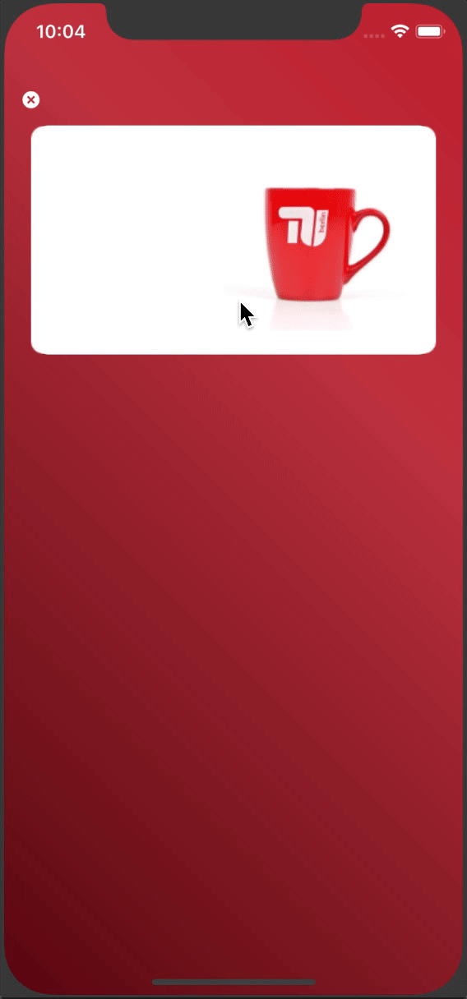
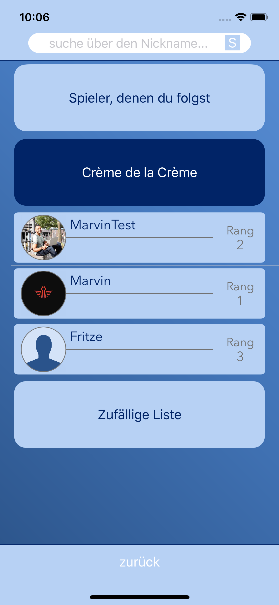
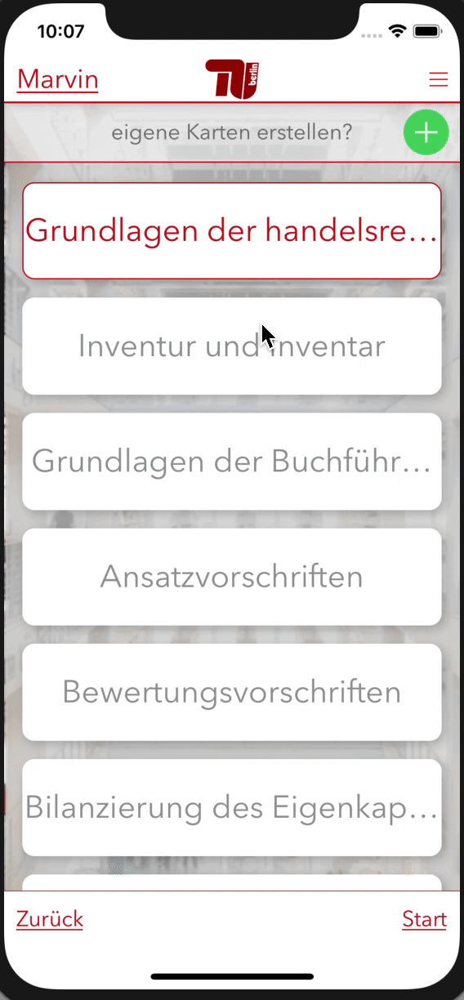

# AccountingApp
I designed and coded this app for the accounting department at TU Berlin.

## Play Quizes
Test your knowledge on accounting playing the course content as a quiz.

## Duel Class mates
Challenge your class mates to find out who knows the most

## Study with Flash Cards
Study for the exam using the build in Flash Card function.

## Check out the video
In the folder Video you can download a video displaying the app in live

## Sneak some code
You can sneak the swift code for some view classes.

## Backend
The backend is running through AWS Mobile Hub
